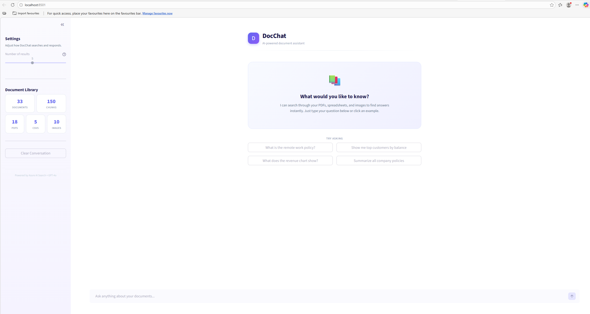

<div align="center">

# DocChat

### AI-Powered Document Assistant

**Ask questions about your PDFs, spreadsheets, and images — get instant, cited answers.**

Built with Azure AI Search, Azure OpenAI, GPT-4o, and Streamlit.


---

[](https://smart-doc-search-ebeagmyzgnnpojgi9edsne.streamlit.app/)



</div>

---

## Overview

DocChat is a **Retrieval-Augmented Generation (RAG)** chatbot that lets you have a conversation with your documents. It combines **hybrid search** (vector + keyword) with **GPT-4o** to deliver accurate, source-cited answers from PDFs, CSVs, and images. If you work with large document libraries or databases, DocChat makes searching through them effortless and instant.

### Key Features

- **Hybrid Search** — Combines semantic vector search with keyword matching for superior retrieval accuracy
- **Multi-Format Support** — PDFs, CSVs, and images (PNG/JPG) with full OCR capabilities
- **Source Citations** — Every answer references the exact documents used, displayed as color-coded badges
- **Streaming Responses** — Real-time answer generation powered by GPT-4o
- **Grounded Answers** — The LLM only uses information from your documents, preventing hallucination
- **Modern UI** — Clean Streamlit interface with chat history, example prompts, and adjustable settings

---

## Architecture

```
                         ┌─────────────────┐
                         │  User Question  │
                         └────────┬────────┘
                                  │
                                  ▼
                    ┌──────────────────────────┐
                    │   Azure OpenAI Embeddings │
                    │  (text-embedding-3-small) │
                    └────────────┬─────────────┘
                                 │
                                 ▼
                    ┌──────────────────────────┐
                    │    Azure AI Search        │
                    │  Hybrid: Vector + Keyword │
                    │  → Top-K relevant chunks  │
                    └────────────┬─────────────┘
                                 │
                                 ▼
                    ┌──────────────────────────┐
                    │     OpenAI GPT-4o         │
                    │  Generates cited answer   │
                    │  from retrieved context   │
                    └──────────────────────────┘
```

### Document Ingestion Pipeline

```
Local Files (PDF, CSV, PNG/JPG)
        │
        ▼
Azure Blob Storage ──► Azure Document Intelligence (OCR)
                               │
                               ▼
                       Text Chunking (800 words, 200 overlap)
                               │
                               ▼
                       Azure OpenAI Embeddings (1536-dim vectors)
                               │
                               ▼
                       Azure AI Search Index
```

---

## Tech Stack

| Component | Technology | Purpose |
|---|---|---|
| **Frontend** | Streamlit | Interactive chat web UI |
| **LLM** | OpenAI GPT-4o | Answer generation with citations |
| **Embeddings** | Azure OpenAI `text-embedding-3-small` | 1536-dim vector embeddings |
| **Search** | Azure AI Search (HNSW) | Hybrid vector + keyword retrieval |
| **OCR** | Azure AI Document Intelligence | Text extraction from PDFs & images |
| **Storage** | Azure Blob Storage | Cloud document storage |
| **Language** | Python 3.12 | Backend |

---

## Project Structure

```
├── app.py                      # Streamlit web UI (main entry point)
├── create_index.py             # Creates the Azure AI Search index schema
├── ingest_documents.py         # Extracts, chunks, embeds, and indexes documents
├── upload_documents.py         # Uploads local files to Azure Blob Storage
├── requirements.txt            # Python dependencies
├── .env                        # API keys and endpoints (not committed)
├── .streamlit/
│   └── config.toml             # Streamlit theme configuration
├── assets/
│   └── screenshot.png          # App screenshot for README
└── azure_rag_test_documents/   # Local test documents
    └── synthetic_documents/
        ├── pdfs/
        ├── csvs/
        └── images/
```

---

## Getting Started

### Prerequisites

- Python 3.10+
- Azure account with the following resources:
  - **Azure Blob Storage** — document storage
  - **Azure AI Document Intelligence** — OCR for PDFs & images
  - **Azure AI Search** — vector index
  - **Azure OpenAI** — with `text-embedding-3-small` deployed
- **OpenAI API key** — for GPT-4o chat completions


### 1. Run the Pipeline (one-time setup)

```bash
python upload_documents.py      # Upload documents to Azure Blob Storage
python create_index.py          # Create the search index schema
python ingest_documents.py      # Extract → chunk → embed → index
```

### 2. Launch the App

```bash
streamlit run app.py
```

Or use the [live demo](https://smart-doc-search-ebeagmyzgnnpojgi9edsne.streamlit.app/).

---

## How It Works

1. **You ask a question** — e.g., *"What is the remote work policy?"*
2. **Hybrid search** — Your question is embedded into a vector and searched against the index using both semantic similarity and keyword matching
3. **Context retrieval** — The top-K most relevant document chunks are retrieved with metadata and relevance scores
4. **Answer generation** — GPT-4o generates a grounded answer using **only** the retrieved context, with source file citations
5. **Source display** — Referenced documents appear as color-coded badges (PDF / CSV / IMG) below the answer

---

## Supported File Types

| Type | Processing Method | Badge |
|---|---|---|
| **PDF** | Azure Document Intelligence (OCR + layout extraction) | `PDF` (red) |
| **CSV** | Pandas row-by-row text conversion | `CSV` (green) |
| **PNG / JPG** | Azure Document Intelligence (OCR) | `IMG` (blue) |

---

## Sample Questions

| Question | Tests |
|---|---|
| *"What is the remote work policy?"* | PDF retrieval + policy extraction |
| *"Show me the top customers by balance"* | CSV data retrieval + number precision |
| *"What does the revenue chart show?"* | Image OCR retrieval |
| *"Summarize all company policies"* | Cross-document synthesis |

---

## License

MIT

---

<div align="center">
  <sub>Built with Azure AI + OpenAI + Streamlit</sub>
</div>
